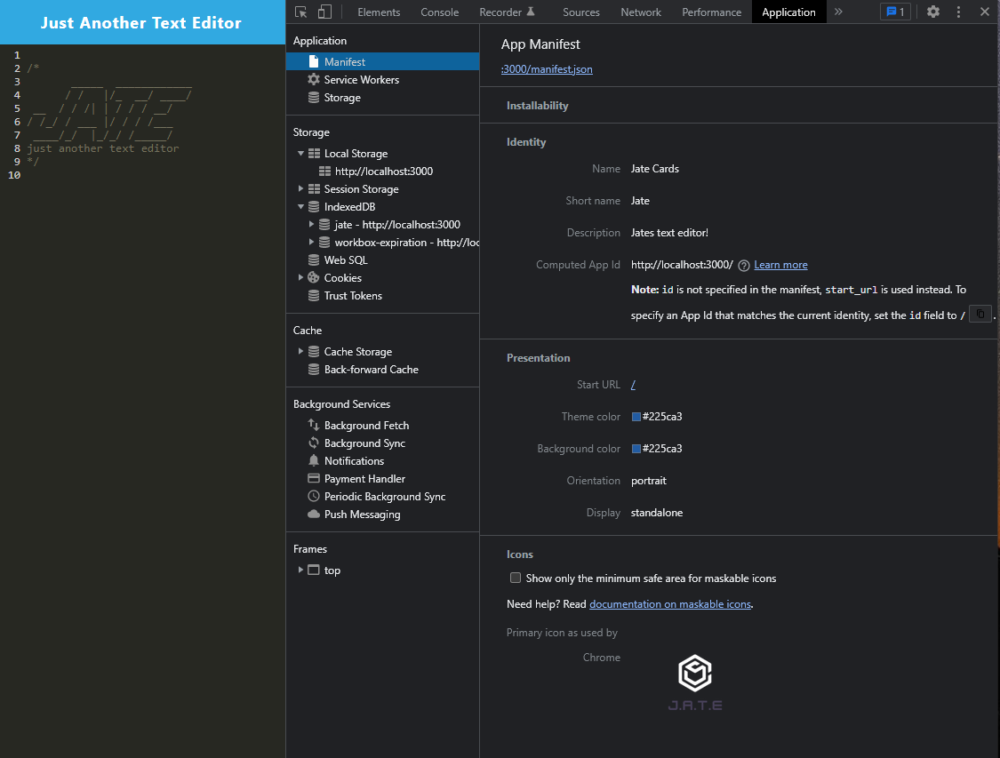
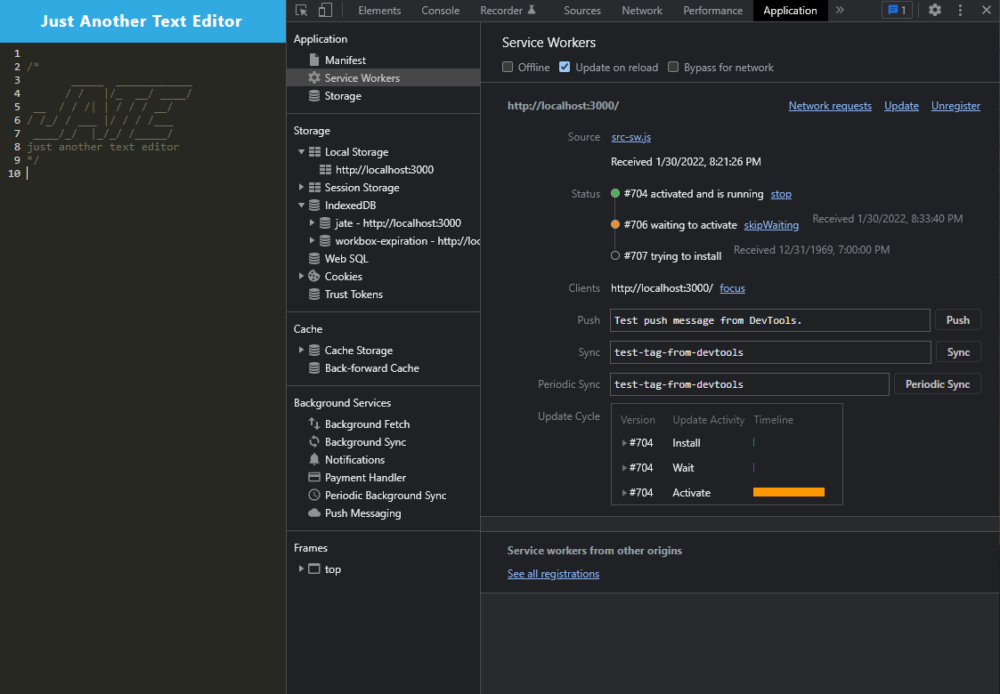
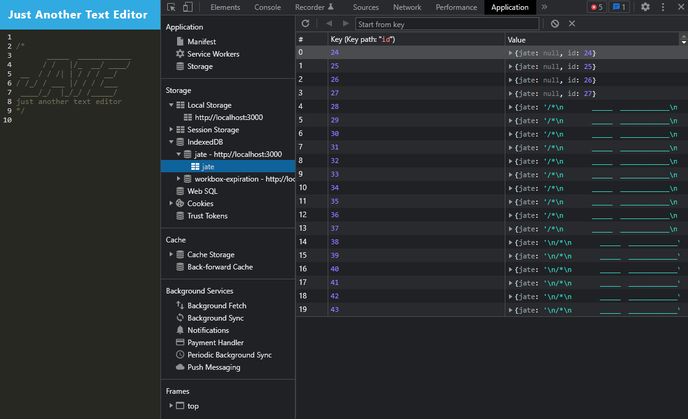

# Text_Editor

## Description

This application is a text editor built to run in the browser. The text editor is single-page application that meets the PWA (Progressive Web Application)criteria. Additionally, it will feature a number of data persistence techniques that serve as redundancy in case one of the options is not supported by the browser. The application will also function offline. To find this application, you can use the heroku link down below. 

## User Story

```md
AS A developer
I WANT to create notes or code snippets with or without an internet connection
SO THAT I can reliably retrieve them for later use
```

## Criteria Provided By Client 

```md
GIVEN a text editor web application
WHEN I open my application in my editor
THEN I should see a client server folder structure
WHEN I run `npm run start` from the root directory
THEN I find that my application should start up the backend and serve the client
WHEN I run the text editor application from my terminal
THEN I find that my JavaScript files have been bundled using webpack
WHEN I run my webpack plugins
THEN I find that I have a generated HTML file, service worker, and a manifest file
WHEN I use next-gen JavaScript in my application
THEN I find that the text editor still functions in the browser without errors
WHEN I open the text editor
THEN I find that IndexedDB has immediately created a database storage
WHEN I enter content and subsequently click off of the DOM window
THEN I find that the content in the text editor has been saved with IndexedDB
WHEN I reopen the text editor after closing it
THEN I find that the content in the text editor has been retrieved from our IndexedDB
WHEN I click on the Install button
THEN I download my web application as an icon on my desktop
WHEN I load my web application
THEN I should have a registered service worker using workbox
WHEN I register a service worker
THEN I should have my static assets pre cached upon loading along with subsequent pages and static assets
WHEN I deploy to Heroku
THEN I should have proper build scripts for a webpack application
```


## Technology Used for Development 
- heroku 
- webpack
- service workers 
- manifest 
- indexedDb
- javaScrip

## Installation
No installation required, please use heroku link down below. 

## Navigation and Demo 
- To see how it is done, please view the following video/gif of how to use this application since it is in the browser.

The application functionality:


The following image shows the application's `manifest.json` file:



The following image shows the application's registered service worker:



The following image shows the application's IndexedDB storage:




## Resources 
- [Heroku Deployment Guide on The Full-Stack Blog](https://coding-boot-camp.github.io/full-stack/heroku/heroku-deployment-guide)
- [webpack](https://webpack.js.org/)
- Class Resources 

## Links 
- GitHub Repositor: https://github.com/ed2022/Text_Editor.git
- Heroku Link: https://still-brushlands-87864.herokuapp.com/
